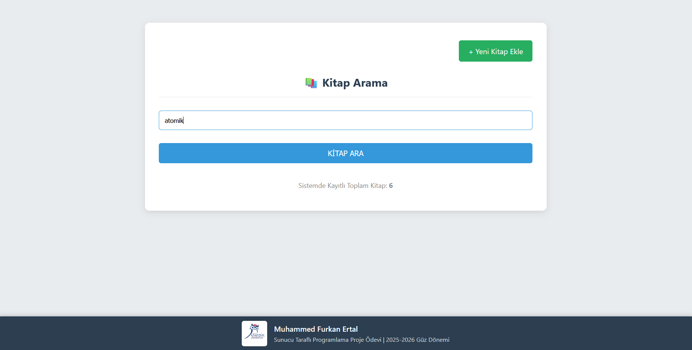
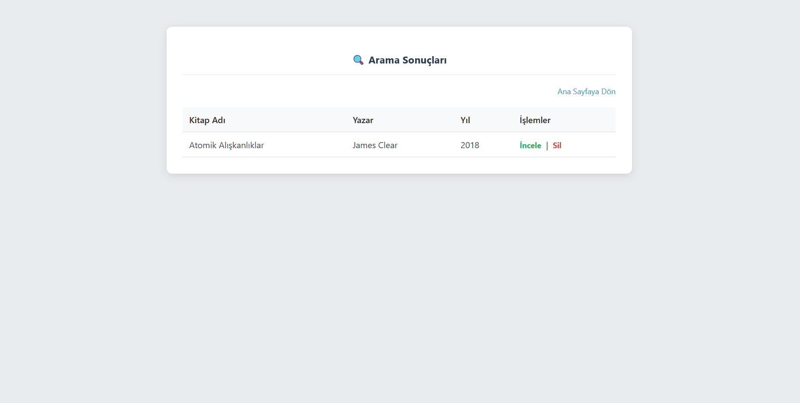
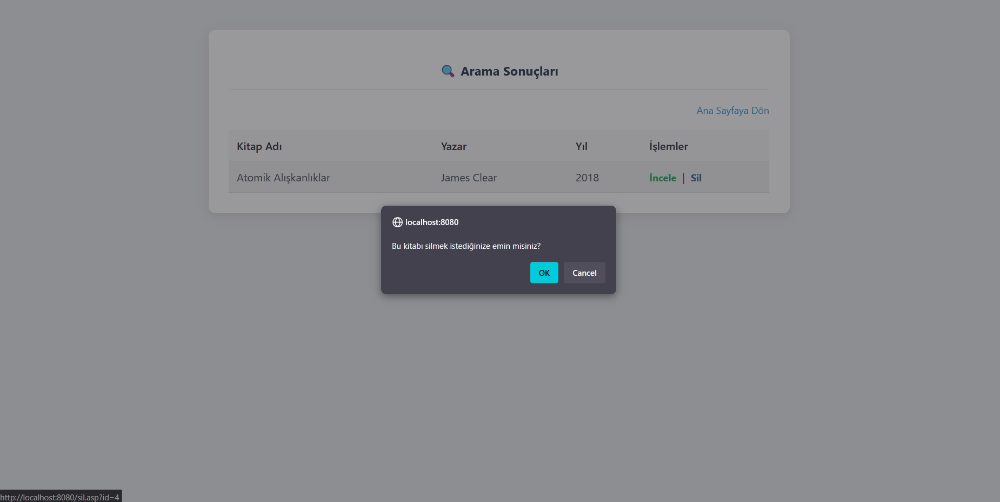

# 📚 Dinamik Kütüphane Otomasyonu (Veritabanısız)

Bu proje, **Sunucu Taraflı Programlama** dersi kapsamında, veritabanı kullanmadan dinamik dizi (Array) ve Session yönetimi mantığıyla geliştirilmiş bir ASP (Active Server Pages) uygulamasıdır.

## 🚀 Proje Özellikleri

Proje, Classic ASP ve VBScript kullanılarak aşağıdaki temel fonksiyonları gerçekleştirmektedir:

* **Veritabanısız Mimari:** Veriler sunucu belleğinde (Session) tutulur.
* **Kitap Arama:** Kitap adı veya yazar adına göre dinamik arama (`Instr` fonksiyonu ile).
* **Kitap Ekleme:** Validasyon kurallarına uygun (Yıl aralığı, karakter sayısı vb.) veri girişi.
* **Listeleme & Detay:** Arama sonuçlarını listeleme ve string parçalama (`Left`, `Mid`) ile detay görüntüleme.
* **Silme:** Session dizisinden ilgili kaydı kaldırma.

## 🛠 Kullanılan Teknolojiler ve Fonksiyonlar

* **Dil:** Classic ASP (VBScript)
* **Arayüz:** HTML5, CSS3 (Flexbox & Responsive)
* **Kullanılan VBScript Fonksiyonları:**
    * `Split()`: Veri setini parçalamak için.
    * `Instr()`: Arama yapmak için.
    * `Replace()`: Veri temizliği için.
    * `Left()` ve `Mid()`: String manipülasyonu için.
    * `Lcase()`: Büyük/küçük harf duyarlılığını kaldırmak için.

## 📦 Kurulum ve Çalıştırma

Bu proje **Baby Web Server** veya **IIS (Internet Information Services)** üzerinde çalıştırılabilir.

1.  Bu repoyu indirin.
2.  `Baby Web Server` uygulamasını başlatın.
3.  Web Pages Path olarak indirilen klasörü seçin.
4.  Tarayıcınızda `http://localhost` adresine gidin.

## 📸 Ekran Görüntüleri

Aşağıda projenin çalışma anından görüntüler yer almaktadır:

### Ana Sayfa ve Footer Görünümü

### Yeni Kitap Ekleme Sayfası

### Kitap Eklendi Bildirimi

### Arama Sonuçları

### Kitap Detay Kartı (İnceleme Fonksiyonu)

### Kitap Silme Onayı Bildirimi

---

## 📂 Hazır Yüklü Veriler (Test İçin)

Proje ilk çalıştırıldığında (Session başladığında), test edilebilmesi için sistem aşağıdaki kitaplarla otomatik olarak açılır. Arama fonksiyonunu test etmek için bu verileri kullanabilirsiniz:

| Kitap Adı | Yazar | Yıl | Tür |
| :--- | :--- | :--- | :--- |
| **Tutunamayanlar** | Oğuz Atay | 1972 | Roman |
| **1984** | George Orwell | 1950 | Roman |
| **Dune** | Frank Herbert | 1965 | Bilim |
| **Fahrenheit 451** | Ray Bradbury | 1953 | Bilim |
| **Atomik Alışkanlıklar** | James Clear | 2018 | Roman |
| **Nutuk** | Mustafa Kemal Atatürk | 1927 | Tarih |

---
**Geliştirici:** Muhammed Furkan Ertal

**Ders:** Sunucu Taraflı Programlama - 2025-2026 Güz Dönemi
